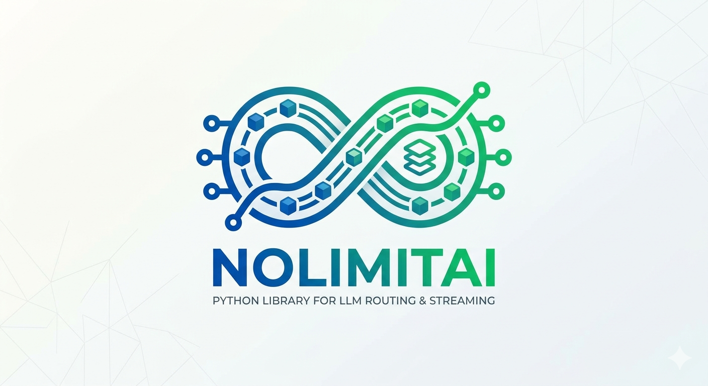

# NoLimitAI

<p align="center">
  
</p>

<p align="center">
  <a href="https://pypi.org/project/naturalsql/"></a>
  <a href="https://pypi.org/project/naturalsql/"></a>
  <a href="https://pypi.org/project/naturalsql/"></a>
  <a href="https://github.com/Zay-M3/NaturalSQL/blob/main/LICENSE"></a>
</p>

NoLimitAI es una librería de Python diseñada para enrutar solicitudes de LLM a través de múltiples proveedores (Groq, OpenRouter, Together AI, Gemini, Mistral) con balanceo de carga "round-robin" integrado y conmutación por error automática. Simplifica la gestión de múltiples servicios de IA a través de una única API asíncrona unificada.

## Características

- **Soporte Multi-Proveedor**: Cambia sin problemas entre Groq, OpenRouter, Together AI, Google Gemini y Mistral AI.
- **Round-Robin y Fallback**: Rota automáticamente entre los proveedores configurados para distribuir la carga y maneja fallos reintentando con el siguiente servicio disponible.
- **Streaming Asíncrono**: Soporte nativo de `async`/`await` con respuestas en streaming.
- **Interfaz Unificada**: Usa una API estándar para todos los proveedores.

## Instalación

Instala el paquete desde PyPI:

```bash
pip install nolimitai
```

Puedes ver el proyecto en PyPI aquí: [https://pypi.org/project/nolimitai/](https://pypi.org/project/nolimitai/)

## Uso

Aquí tienes un ejemplo completo de cómo configurar y usar NoLimitAI.

### 1. Configuración Básica

Debes proporcionar las claves API para los servicios que desees usar. La librería no carga automáticamente las variables de entorno; debes pasarlas explícitamente.

```python
import asyncio
import os
from nolimitai import NolimitAI

# Opcional: Cargar variables de entorno desde un archivo .env
# from dotenv import load_dotenv
# load_dotenv()

async def main():
    # Inicializar el cliente
    nlai = NolimitAI()

    # Configurar el cliente con tus API keys y parámetros opcionales
    # Solo necesitas proporcionar claves para los servicios que pretendas usar.
    nlai.set_config(
        temperature=0.7,
        max_tokens=1024,
        top_p=0.9,
        keys={
            "groq": os.getenv("GROQ_API_KEY"),
            "openrouter": os.getenv("OPENROUTER_API_KEY"),
            "gemini_ai": os.getenv("GEMINI_API_KEY"),
            "mistral_ai": os.getenv("MISTRAL_API_KEY"),
            "together_ai": os.getenv("TOGETHER_API_KEY"),
        }
    )

    prompt = "Explica el concepto de planificación round-robin en una frase."

    print(f"--- Preguntando: {prompt} ---\n")

    # Verificar cuál servicio es el siguiente en la fila (opcional)
    next_service = nlai.get_next_service()
    print(f"[Siguiente Servicio]: {next_service}")

    try:
        # Streaming de la respuesta
        print("[Respuesta]: ", end="", flush=True)
        async for token in nlai.chat(prompt=prompt):
            print(token, end="", flush=True)
        print("\n")
        
        # Verificar qué servicio manejó realmente la solicitud
        used_service = nlai.get_last_used_service()
        print(f"[Servicio Usado]: {used_service}")

    except Exception as e:
        print(f"\nOcurrió un error: {e}")

if __name__ == "__main__":
    asyncio.run(main())
```

### 2. Opciones de Configuración

El método `set_config` acepta los siguientes parámetros:

- `temperature` (float): Temperatura de muestreo (0.0 a 1.0).
- `max_tokens` (int): Número máximo de tokens a generar.
- `top_p` (float): Parámetro de muestreo "nucleus".
- `keys` (dict): Un diccionario mapeando nombres de proveedores a sus API keys.

**Claves Soportadas:**
- `"groq"`
- `"openrouter"`
- `"together_ai"`
- `"gemini_ai"`
- `"mistral_ai"`

## Notas Importantes

- **Tolerancia a Fallos**: Si un servicio falla al conectar o autorizar, el router intentará automáticamente con el siguiente servicio configurado en la lista.

## Solución de Problemas

- **`RuntimeError: NoLimitIA no ha sido configurado`**: Este error ocurre si intentas llamar a `chat()` antes de llamar a `set_config()`. Asegúrate de configurar la instancia con al menos una API key válida.
- **Errores de Autenticación**: Asegúrate de que tus API keys sean correctas. Si una clave es inválida, el router lo tratará como un fallo e intentará cambiar a otro proveedor si hay alguno disponible.

## Licencia

Este proyecto está licenciado bajo la Licencia Apache-2.0.

[English documentation](./README.md)
